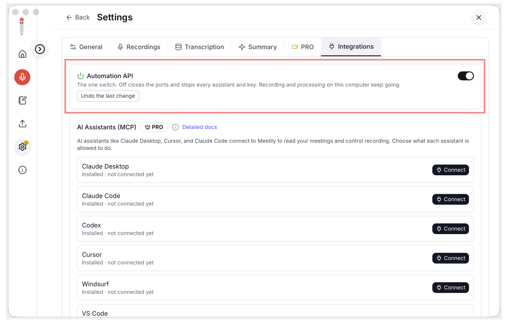
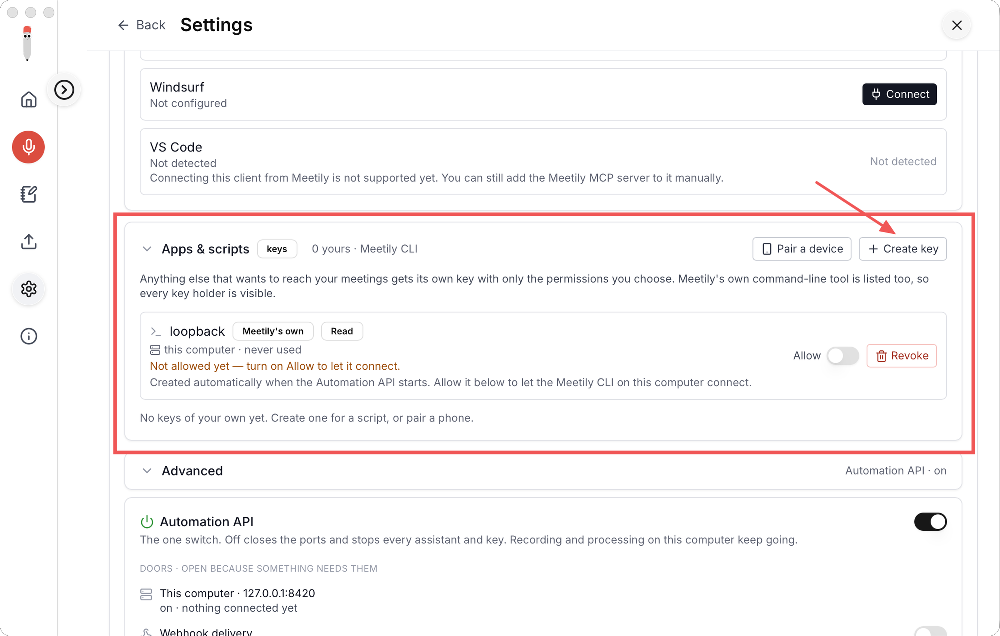
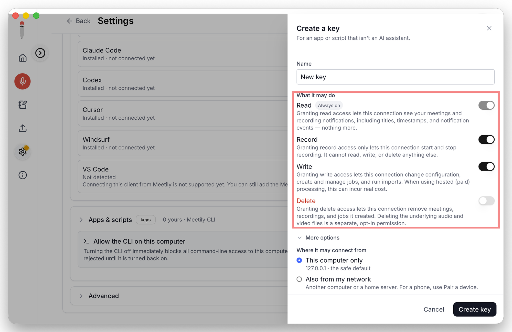
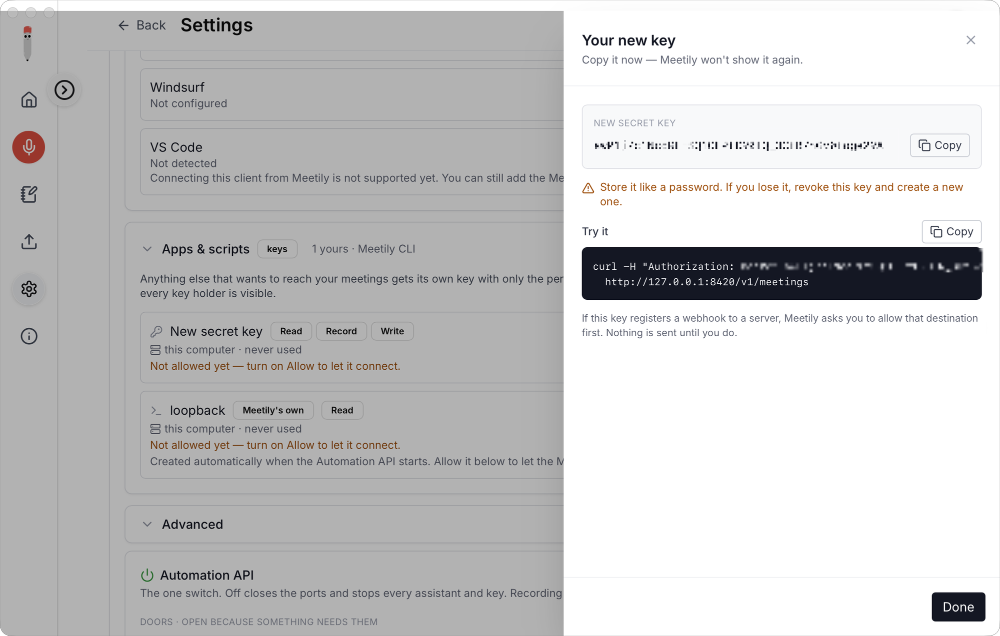
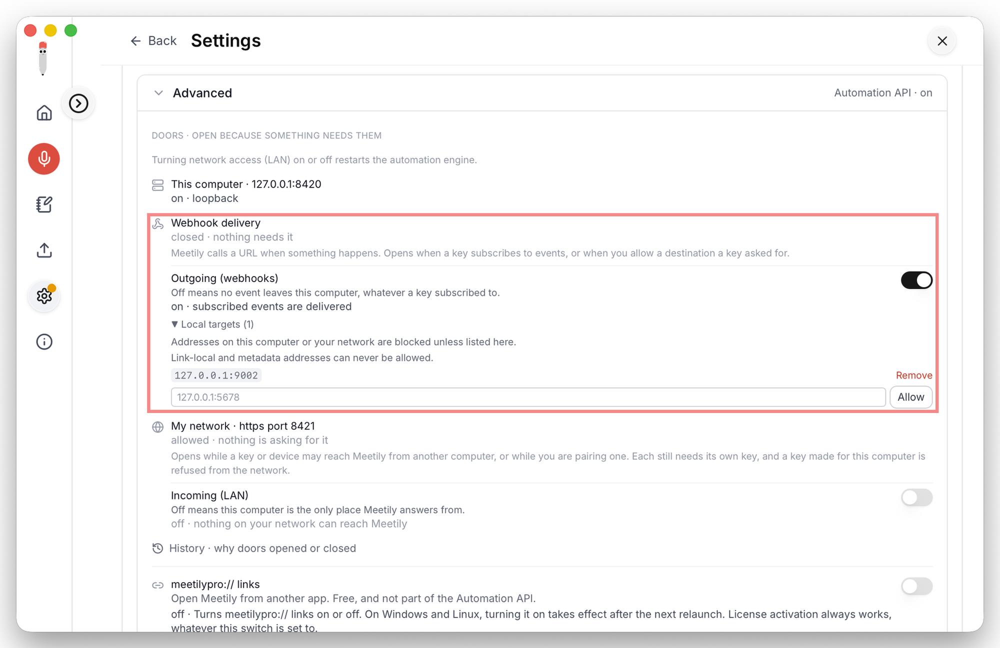
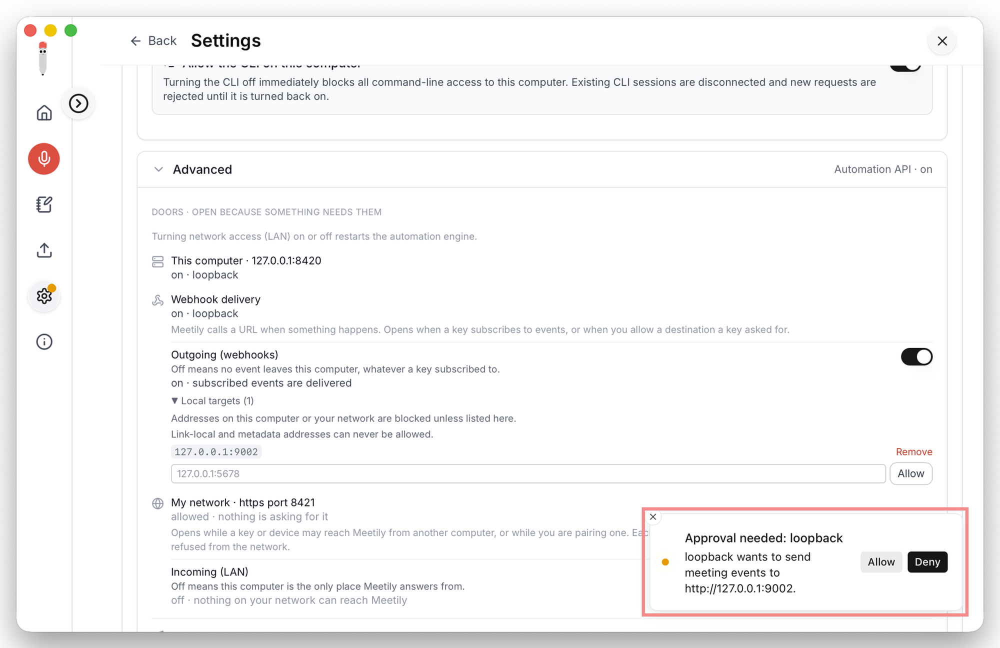
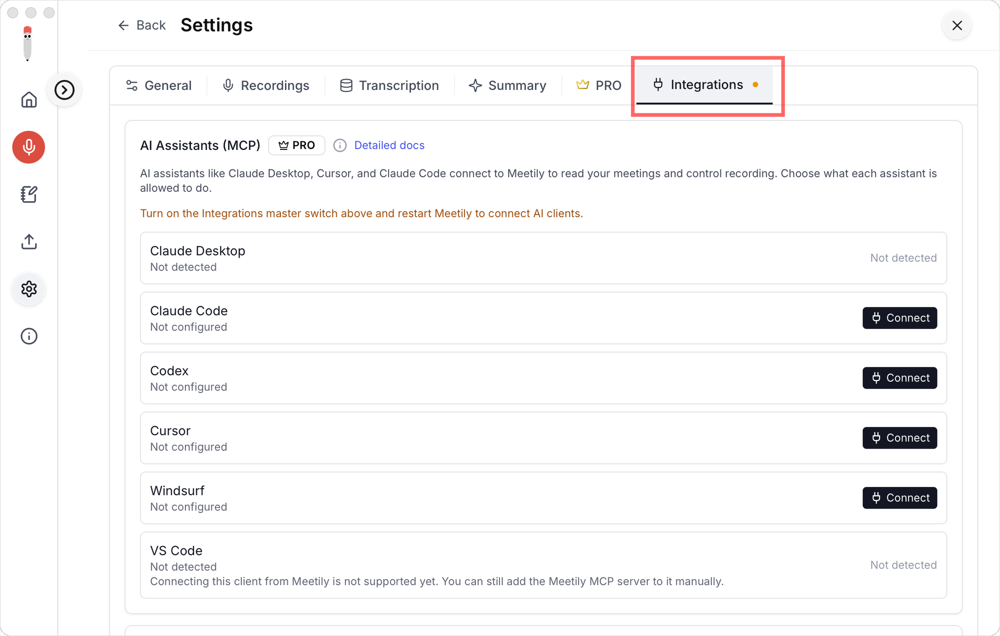

# Meetily Workflows Examples

This repo is an examples hub for building automations against the **Meetily
Agent API as it ships today** -- the local HTTP API, `meetily-pro` CLI, MCP
server, and webhooks that already exist in the Pro app. It shows the pattern
(subscribe to an event, verify it, fetch the content you need, act on it) with
small, runnable examples.

It is **not** the Workflows product. Meetily Workflows (workflow definitions,
connectors, a manifest schema, an execution engine) is a separate, next-release
product. This repo does not scaffold any of that -- see
[Open question](#open-question-whats-next).

> **Availability:** the Meetily Agent API (and the automations you build on it)
> is a **Meetily Pro** feature today. Support for the **Community (open-source)
> edition** is coming soon.

> **Version:** everything here matches **Meetily Pro 1.10.0**, the first
> release with the Automation API. The API is **off by default**; nothing
> listens until you turn it on (see [Setup](#setup-turn-it-on)). The
> `meetily-pro` CLI ships inside the app, and `meetily-pro mcp doctor` warns
> if the CLI and app versions differ.

> Full developer documentation: **https://docs.meetily.ai/developers**. The
> tables below are a quick reference; the docs site and `GET /openapi.json` are
> the source of truth.

## Setup: turn it on

Everything ends up in the **Integrations** tab under **Settings** -- but that
tab only appears once you've turned the Automation API on at least once. The
first time, go to **Settings > PRO** and click **Turn on** in the
**Integrations** card; after that the tab stays in Settings for good, even if
you turn the API off again. The screenshots below are macOS; the Windows
layout is equivalent.

**1. Turn on the Automation API.** First time: **Settings > PRO**, click
**Turn on** in the **Integrations** card. After that, the same control is the
master switch at the top of **Settings > Integrations** -- it takes effect
immediately, no restart. Turning it off later closes the ports and stops every
assistant and key, but recording/transcription/summary keep running.



**2. Allow the CLI.** A highlighted strip titled **"Allow the CLI on this
computer"**, always visible above **Apps & scripts**, covers Meetily's own
auto-created **`loopback`** key (Read-only). Turn on its **Allow** switch so
the `meetily-pro` CLI on this computer can connect. (This key can't be revoked
from the UI.)



**3. Create a scoped key** (for a script/app). Click **+ Create key**, choose
permissions (Read is always on; add Record/Write/Delete as needed), and set
reach + expiry under **More options**.



The secret is shown **once** -- copy it now. Then turn on **Allow** for the new
key too (every key starts off).



**4. Enable webhook delivery.** In **Advanced**, turn on the **Webhook
delivery** door. To deliver to a receiver on this machine, add its `host:port`
(e.g. `127.0.0.1:8787`) under **Local targets** *before* you register the
webhook -- otherwise registration is refused with `400 bad_request` ("url host
is not allowed (loopback/private)"). It takes effect immediately, no restart
needed.



**5. Approve the destination.** After a key registers a webhook, Meetily shows a
**"Waiting for you"** banner. Click **Allow** so its `approval_state` becomes
`allowed` -- only `allowed` delivers, and a `pending` destination fails
silently. Every destination, including one you denied, is also listed under
**Advanced > Destinations**, where you can allow it later.



To connect an AI assistant instead, use the **AI assistants (MCP)** section and
click **Connect** on a detected client (Claude Desktop, Claude Code, Cursor, ...).
The Integrations master switch at the top of the tab has to be on first -- no
restart needed either way.



Full walkthrough (both platforms, plus pairing a remote device):
**https://docs.meetily.ai/developers/enable-and-connect**

## Tokens: pick the right one first

Every call to the API needs a token, and **the token decides what your
automation may do**. There are two kinds:

| Token | Scopes | How you get it | Use it for |
|---|---|---|---|
| Loopback token file (Meetily's own `loopback` key) | **Read only** | Created by the app; turn on **Allow the CLI on this computer** (Setup step 2). Found automatically by the CLI and `discover_token()` | Reading meetings/transcripts/summaries, registering webhooks, SSE waits |
| A key you create | Read + any of **Record / Write / Delete** you tick | **Settings > Integrations > Apps & scripts > Create key** (Setup step 3), then turn on its **Allow** switch | Anything that changes something |

**If your automation records, writes, or deletes, it needs a key you
create -- the loopback token always gets `403 insufficient_scope` there.**

| Your automation... | Needs scope | Example routes |
|---|---|---|
| starts/stops/pauses/resumes recording | `record` | `POST /v1/recording/start`, `POST /v1/recording/stop` |
| renames meetings, saves or regenerates summaries, edits speaker labels, controls jobs, runs imports, changes settings | `write` | `PUT /v1/meetings/{id}/summary`, `POST /v1/meetings/{id}/summary/regenerate`, `POST /v1/jobs/import` |
| deletes meetings | `delete` | `DELETE /v1/meetings/{id}` |
| only reads and listens | `read` | everything else in [HTTP API](#http-api) |

Steps for a record/write/delete key:

1. **Settings > Integrations > Apps & scripts > Create key.** Tick only the
   scopes you need (Read is always on); set reach and expiry under **More
   options**.
2. **Copy the secret now** -- it is shown once.
3. Turn on the new key's **Allow** switch. Every key starts off, and an off
   key gets `403 consumer_disabled`. (`401 unauthorized` means the token
   itself is unknown, expired, or revoked.)
4. Hand it to your automation without putting it in code:
   ```bash
   export MEETILY_PRO_TOKEN='<the secret>'
   # or: meetily-pro --token-file /path/to/secret-file <command>
   ```
5. Check it: `meetily-pro whoami` (or `GET /v1/whoami`) lists the scopes the
   token really has.

How the CLI and `meetily_agent` pick a token is under
[Token resolution order](#token-resolution-order). MCP assistants are
different: **Connect** mints each assistant its own token, and you opt in to
Record/Write for it in the app.

## The frozen trigger catalogue

The trigger ids you can build on today, the backing event each maps to, and
whether that event fires in the current release:

| Trigger id | Backing event | State |
|---|---|---|
| `recording-ends` | `recording.stopped` | LIVE |
| `summary-ready` | `summary.completed` | LIVE |
| `import-finishes` | `job.completed` (import job) | LIVE |
| `transcript-ready` | `transcription.completed` | **DORMANT** -- no producer this release |

Do not subscribe to `transcription.completed` expecting it to fire; it is
reserved with no producer behind it yet.

## Build against the API today

Every example follows the same shape:

0. **Get the right token** -- the loopback token for read-only work, or a key
   you created for anything that records, writes, or deletes (see
   [Tokens](#tokens-pick-the-right-one-first)).
1. **Subscribe** -- `POST /v1/webhooks` with your receiver URL and the events you want.
2. **Verify** -- check `X-Meetily-Signature` (HMAC-SHA256 over `"{timestamp}.{body}"`, using `X-Meetily-Timestamp`) against the `hmac_secret` from registration, constant-time.
3. **Dedup** -- key on `event_id`. Delivery is at-least-once; you can see an event more than once.
4. **Fetch content** -- the event is notification-only. Use your token to fetch, e.g. `GET /v1/meetings/{id}`, its transcript, or its summary.
5. **Act** -- do whatever your automation does.

### Event envelope

```json
{
  "schema_version": 1,
  "event_id": "...",
  "event": "recording.stopped",
  "occurred_at": "...",
  "resource": { "kind": "meeting", "id": "..." },
  "delivery_id": "..."
}
```

`event_id` is the dedup key; `resource.id` is what you fetch content for. No
transcript or summary text is ever in the envelope.

## Quick reference

Brief tables; full detail on the docs site linked under each.

### Scopes

| Scope | Grants | Notes |
|---|---|---|
| `read` | See meetings, transcripts, summaries, status, and receive notifications | Always on for any key |
| `record` | Start / stop / pause / resume recording | Implies `read` |
| `write` | Edit titles/labels, set/regenerate summaries, control jobs, run imports, change some settings | Implies `read`; regeneration can spend hosted LLM credits |
| `delete` | Delete a meeting (audio/video files are a separate opt-in) | Stands alone; never on a paired device; never an MCP tool |

There is **no `admin` scope** -- administration is desktop-UI only. Every key
(and paired device) is off until you turn on its **Allow** toggle.
Full: https://docs.meetily.ai/developers/authentication

### CLI (`meetily-pro`)

A thin HTTP client -- one gateway call per command. Token: `--token-file` >
`MEETILY_PRO_TOKEN` > the loopback token file.

| Exit code | Meaning |
|---|---|
| `0` | Success |
| `1` | Error (incl. parse/usage) |
| `2` | Timeout |
| `3` | Cannot connect |
| `4` | Denied (401/403) |

Common commands: `meetily-pro health|doctor|version|whoami|search`,
`meetings list|get|export|rename|delete|speaker-labels`, `transcript get`,
`summary get|set|wait|regenerate`,
`jobs list|get|wait|diarization|cancel|pause|resume|retry|import`,
`config get|set`, `devices list`, `models list`,
`recording start|stop|pause|resume|status|wait`,
`webhooks add|list|get|remove|deliveries|test`, `install-cli`, `pair`, `mcp`.
Full: https://docs.meetily.ai/developers/cli

### MCP (`meetily-pro mcp`)

A local stdio Model Context Protocol server wrapping the same gateway (never
touches the DB); inherits the Pro gate and per-route scopes.

| Aspect | Detail |
|---|---|
| Tools | 33 total (20 read / 9 write / 4 record, incl. 2 bounded-wait); 28 advertised by default (5 webhook tools gated behind `--allow-webhooks`) |
| Read-only | `meetily-pro mcp --read-only` hides and refuses write tools |
| Delete | Never exposed as a tool, in any mode |
| Install | `meetily-pro mcp install [--config PATH] [--name NAME]` prints a handoff -- the `mcpServers` entry plus the app screen name (Settings > Apps & scripts). It mints no token and writes no client config; the app does both when you click **Connect**. `--record`/`--write` on `install` are accepted but do nothing |
| Doctor | `meetily-pro mcp doctor` checks gateway reachability, Pro license tier, and token scopes |
| Resources | `meetily://meetings`, `meetily://meeting/{id}`, `meetily://transcript/{id}`, `meetily://summary/{id}` |

`meetily://` (MCP resources) is not `meetilypro://` (the OS deep-link scheme).
Full: https://docs.meetily.ai/developers/mcp

### HTTP API

Base `http://127.0.0.1:8420`. This table is a quick reference (43 routes
total); canonical machine-readable reference: `GET /openapi.json`.

| Route | Scope | Use |
|---|---|---|
| `GET /v1/whoami` | read | Token identity + scopes |
| `GET /v1/meetings` | read | List meetings: `{meetings:[...], total, limit, offset}` |
| `GET /v1/meetings/{id}` | read | One meeting (`{id, title, created_at, updated_at}`) |
| `GET /v1/meetings/{id}/transcript` | read | `{meeting_id, title, segments:[{text, timestamp, ...}]}` |
| `GET /v1/meetings/{id}/summary` | read | `{meeting_id, status, result?, error?, regeneration_failed?, updated_at}`; `404 not_found` if the meeting has no summary yet |
| `POST /v1/webhooks` | read | Register a webhook |
| `GET /v1/webhooks` | read | List your subscriptions |
| `GET /v1/webhooks/{id}` | read | One subscription + its live `approval_state` |
| `DELETE /v1/webhooks/{id}` | read | Unregister |
| `GET /v1/webhooks/{id}/deliveries` | read | Delivery log (status/attempts per event) |
| `POST /v1/webhooks/{id}/test` | read | `202`; sends one `webhook.test` event (`resource: {kind: "subscription", id: null}`) to an `allowed` destination; `409 host_not_approved` before approval |
| `GET /v1/jobs/{id}/wait?timeout=<s>` (SSE) | read | Wait for a job to finish (default 300 s) |
| `GET /v1/recording/wait?until=started\|stopped&timeout=<s>` (SSE) | read | Wait for recording to start or stop; `until` is required (default timeout 30 s / 3600 s) |
| `GET /v1/meetings/{id}/summary/operations/{operation_id}/wait?timeout_ms=<ms>` (SSE) | read | Wait for a summary regeneration to finish |

Each SSE wait sends one terminal event (or a `timeout` event) and closes; every timeout is capped at 3600 s.
If the state is already reached when you call it, the wait returns at once:
`until=stopped` while nothing is recording answers immediately with a
`recording.stopped` whose `resource.id` is `null`. To wait for the end of a
recording you start, call `until=stopped` after `start` has returned.

Error envelope: `{"error":{"code":"...","message":"...","retryable":true|false}}`
with codes `not_found`, `bad_request`, `forbidden`, `insufficient_scope`,
`conflict`, `license_required`, `invalid_request`, `internal`, `unauthorized`, `consumer_disabled`,
`api_disabled`, `webhooks_disabled`, `host_not_approved`, `too_many_requests`
-- this list is not exhaustive, see the docs.
Full: https://docs.meetily.ai/developers/api-reference

### Webhooks & events

| Aspect | Detail |
|---|---|
| Register | `POST /v1/webhooks` `{"url","events":[...],"delivery_mode":"at-least-once"\|"at-most-once"}` |
| Secret | `hmac_secret` returned once in the `201` |
| Approval | `GET /v1/webhooks/{id}` -> `approval_state` `pending`/`allowed`/`denied`; only `allowed` delivers |
| Signature | `X-Meetily-Signature: sha256=<hex>` over `"{timestamp}.{body}"` + `X-Meetily-Timestamp` |
| Delivery | Best-effort at-least-once, up to 6 attempts (1/2/4/8/16s) while the app runs; duplicates possible; no replay after restart |

The 17 events (all `read`-scoped, notification-only):
`recording.{started,stopped,paused,resumed,failed,error,stop_failed}`,
`job.{submitted,completed,failed,cancelled,paused,resumed,removed}`,
`summary.{completed,failed}`, `transcript.updated`. (`meeting.*` is not
subscribable.) A content-preserving summary-regeneration failure rides
`summary.completed` with a `content_preserved` marker, not `summary.failed`.
Full: https://docs.meetily.ai/developers/webhooks-and-sse and
https://docs.meetily.ai/developers/events

Notes:
- `recording stop` while nothing is recording is a no-op (200, state `idle`) and fires no `recording.stopped` event.
- `recording.stopped` fires as soon as capture stops. The meeting's final title and transcript finish saving a few seconds later, so wait briefly before fetching them (the `brief_on_recording_stopped.py` example waits 10 s).
- Known limitation in 1.10.0: stop is bound to the last session the gateway recorded, not necessarily the live recording. The stop reply can name a stale `capture_session`, and a stop targeted at a stale session id could stop a different live recording. Send an untargeted stop unless the session id came from your own `start` call.
- A key scoped to specific meetings only sees those meetings; the jobs write routes (`cancel`/`pause`/`resume`/`retry`/`diarization`) enforce the same scope, and `active_meeting_id` is redacted to `null` for a scoped key when the active meeting is outside its scope.
- The same concept has two wire names depending on transport: a content-preserving regeneration failure is `regeneration_failed: true` in the `GET .../summary` response, and `content_preserved` on the `summary.completed` event.

## Community workflows

Automations built by the community, cataloged here. Each entry is a **manifest**
(metadata) pointing at the contributor's own repo -- **the code is not hosted
here**. Workflows run standalone against the shipping API/CLI/MCP/webhooks; they
do not integrate with the app in this version.

<!-- BEGIN CATALOG -->
| Workflow | Trigger | Language | Scopes | Author |
| --- | --- | --- | --- | --- |
| [Summary file backup](https://github.com/Zackriya-Solutions/meetily-workflows) | `summary-ready` | python | read | Meetily (github.com/Zackriya-Solutions) |

_1 community workflow(s). Generated from `community-workflows/*/manifest.yaml` by `scripts/generate_catalog.py` -- do not edit this table by hand._
<!-- END CATALOG -->

Full index and how it works: [`community-workflows/`](community-workflows/README.md).
To add yours (any language -- Python, TypeScript, ...), see
[CONTRIBUTING](CONTRIBUTING.md). The table above is generated from
`community-workflows/*/manifest.yaml` by `scripts/generate_catalog.py`; don't
edit it by hand.

## Prerequisites (recap)

1. Meetily Pro, with the Automation API turned on (see [Setup](#setup-turn-it-on)).
2. A token (see [Tokens](#tokens-pick-the-right-one-first)): the loopback
   token file for read-only automations (`discover_token()` finds it), or a
   key you created with the Record/Write/Delete scope it needs, passed via
   `MEETILY_PRO_TOKEN` or `--token-file`.
3. For a non-public receiver: add its `host:port` under **Settings >
   Integrations > Advanced > Local targets** *before* registering (applies
   immediately; without it registration fails with `400 bad_request`).
4. **Allow** the destination in the **Waiting for you** strip (the first
   webhook a key registers to a host starts `pending`), or later under
   **Advanced > Destinations**. Approval is per key and host, so later
   webhooks from the same key to that host come back `allowed` straight away.

### Token resolution order

1. `--token-file` (explicit path)
2. `MEETILY_PRO_TOKEN` environment variable
3. The loopback token file for your OS:
   - macOS: `~/Library/Application Support/pro.meetily.ai/gateway-token`
   - Windows: `%APPDATA%\pro.meetily.ai\gateway-token`
   - Linux: `$XDG_DATA_HOME/pro.meetily.ai/gateway-token`

The loopback token file is loopback-only and read-only. To record, write back
(e.g. `PUT /v1/meetings/{id}/summary`), or delete, create a key with that
scope ([steps](#tokens-pick-the-right-one-first)) and pass it via
`MEETILY_PRO_TOKEN` or `--token-file` -- both take priority over the loopback
file.

## Unsupported: the vendored helper

`meetily_agent/` is a small, stdlib-only Python helper vendored into this repo
so the Python examples need no dependency. It is **not** on PyPI, has no support
or versioning guarantees, and is **not** the supported client (that's the
`meetily-pro` CLI). Copy what you need out of it; don't depend on it as a
package.

## Honest copy

- **"Nothing leaves the machine" is only true for a loopback receiver.** A LAN/remote receiver means events and any content your automation fetches leave the machine.
- **Delivery is best-effort at-least-once** (6 attempts, 1/2/4/8/16s) while the app runs; duplicates possible, events can be lost, no replay after restart. Handlers must be idempotent on `event_id`.
- **A 2xx from your receiver means "accepted," not "your automation succeeded."**
- **Write-back can cost money** -- regenerating and saving a summary can consume hosted LLM credits.
- **This cannot make recording faster or slower** -- automations run off the hot path; don't claim otherwise.
- **Enterprise/fleet features are out of scope here.**

## Where the contracts come from

This README and the examples are a convenience layer, not the source of truth:

- **https://docs.meetily.ai/developers**
- `GET /openapi.json` on your running instance

## Open question: what's next

The long-term shape of "workflows" for Meetily -- definitions/templates, a
connector model, a manifest schema, an execution engine -- is deferred to the
Workflows product in a later release. This repo does not guess at that shape;
when it ships, expect this repo to either fold into that product's examples or
stay focused on the raw API/CLI/MCP/webhook layer underneath it.

## License

MIT, see [LICENSE](LICENSE).
